# iCares

A productivity tool that combines a Pomodoro timer, eye-care reminders, and a to-do list, helping users maintain deep focus while safeguarding their eye health.

🔗 **[Live Demo](https://i-cares.vercel.app)**
*(You are welcome to click the link above to explore. The following test accounts are provided for quick login)*
* **Test Account:** `aa@aa.com`
* **Password:** `aaaaaa`

> 🇹🇼 [閱讀繁體中文版本 (Read in Traditional Chinese)](./README.zh-TW.md)

---

## About The Project

The inspiration for iCares came from my personal experience. In February 2025, I underwent eye laser surgery due to recurrent corneal erosion. This experience made me highly sensitive to eye fatigue and underscored the critical importance of eye protection.

I noticed that most Pomodoro timers on the market focus solely on improving work efficiency, lacking mechanisms to protect the eyes. Therefore, I decided to combine my software development skills with scientific theories to build a tool that enhances productivity while safeguarding visual health.

### Why iCares? (The Problems with Traditional Pomodoro Timers)
While the traditional Pomodoro technique (25 mins work / 5 mins rest) lowers the barrier to starting a task, it has several critical flaws:
1.  **Predictable & Rigid Timing:** The fixed schedule makes the brain numb quickly, losing the sense of reward and novelty.
2.  **Subjective Design:** The 25-minute interval is subjective and doesn't fully align with human natural biological rhythms (Ultradian Rhythms).
3.  **Ignoring Eye Health:** Traditional timers focus solely on work output, completely neglecting the strain placed on the eyes during long periods of deep focus.

iCares solves these pain points by integrating four scientific theories into its core timer mechanism.

### Scientific Foundations

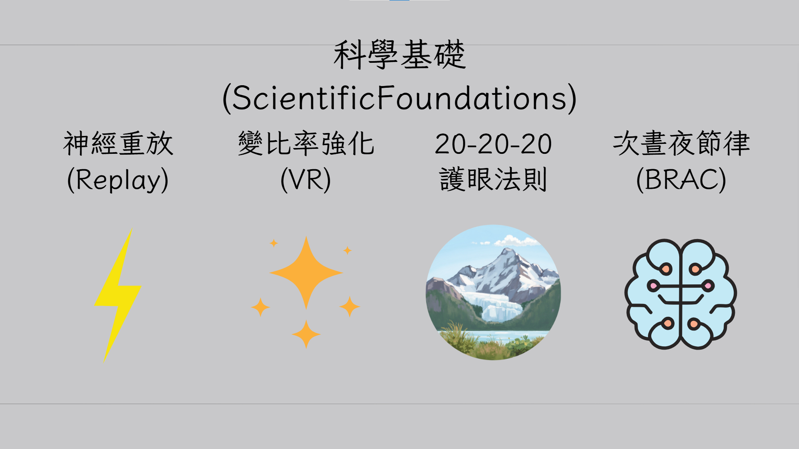

iCares translates scientific theories into practical product mechanisms:

1.  **Neural Replay & Variable Ratio Reinforcement:** Similar to the random rewards of drawing cards or scrolling through short videos. The system plays random audio cues during focus sessions, prompting users to close their eyes and rest for a few seconds. This unpredictability stimulates dopamine secretion, sustains focus, and allows the brain time to "replay" and consolidate newly absorbed memories.
2.  **20-20-20 Rule:** Every 20 minutes, the system prompts the user to look at something 20 feet (about 6 meters) away for 20 seconds, thereby relaxing the eye muscles.
3.  **Ultradian Rhythms:** After accumulating 100 minutes of focus time, the system triggers a reminder, suggesting the user take a 20-minute low-frequency deep rest.

---

## Key Features

- **Scientific Eye-Care Timer:** Automatically schedules and plays audio cues in the background, perfectly integrating Variable Ratio Reinforcement, the 20-20-20 rule, and Ultradian Rhythms.
- **Focus Social:** Displays real-time online user status (Focusing / Offline) and total accumulated focus hours, complete with a chat room feature to create a co-learning/co-working atmosphere.
- **Focus Heatmap:** Visualizes the daily distribution of focus time, making it easy for users to track long-term study or work habits.
- **Integrated To-Do List:** An intuitive task management interface that seamlessly syncs with the timer to help users stay on track.
- **Ambient Music Player:** Built-in Lofi Girl radio to help users enter a state of flow more quickly.

---

## Website DEMO

### 1. Core Focus & To-Do Integration (Main Features)
An immersive workspace combining white noise, Pomodoro countdown, and to-do lists.
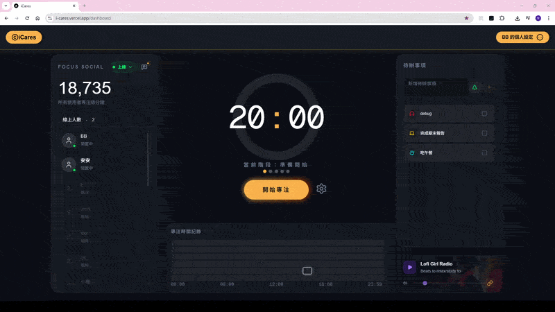

### 2. Member Dashboard (Member Center)
Records daily focus duration.
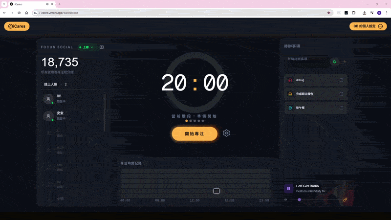

### 3. Interactive Guide (Guide Page)
An interactive tutorial upon first login to help users quickly understand the scientific eye-care mechanisms.
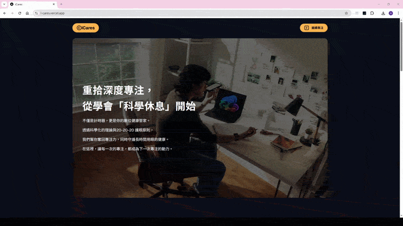

### 4. Responsive Web Design (RWD: Mobile & Tablet)
Fully supports cross-device experiences, maintaining excellent user flows whether on 360px or 768px screens.

  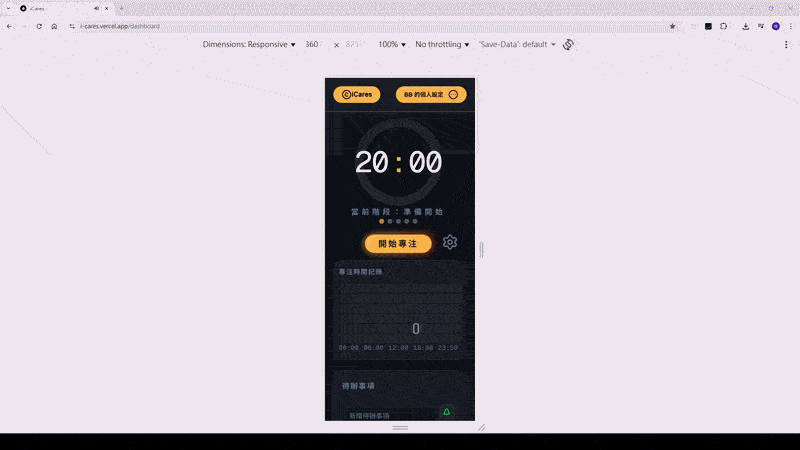
  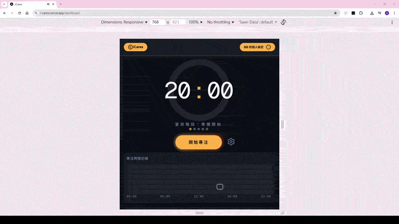

---

## Tech Stack

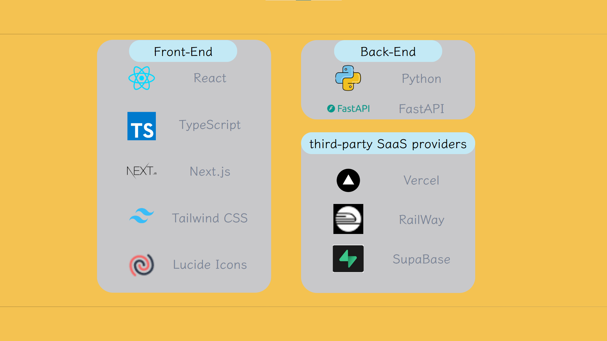

**Frontend**

- **Framework:** Next.js, React
- **Language:** TypeScript
- **Styling & UI:** Tailwind CSS, Lucide Icons
- **State Management:** React Context API
- **Deployment:** Vercel

**Backend**

- **Framework:** FastAPI
- **Language:** Python
- **Deployment:** Railway

**Database & Tools**

- **Database:** Supabase (PostgreSQL)
- **Version Control:** Git / GitHub

---

## Technical Challenges & Solutions

**Challenge: Timer Inaccuracy and State Loss due to Browser Throttling**
When a user minimizes the webpage to the background or switches tabs, browsers throttle the execution of background scripts to save resources. This causes the frontend timer to slow down and desync from real time. Furthermore, refreshing or accidentally closing the tab completely wipes the timer's state.

**Solution: Server Authority Pattern**
To solve this issue, I abandoned the fragile frontend `setInterval` approach and adopted a "Server Authority" architecture:
1.  When a focus session starts, the frontend calculates the expected `end_time` and sends it to the backend (FastAPI) to be persisted in the database (Supabase).
2.  During each frontend re-render, the frontend dynamically calculates the remaining time by subtracting the `current_time` from the database-stored `end_time`.
3.  **Result:** The timer remains perfectly accurate regardless of how the browser throttles background processes, switches tabs, refreshes, or if it's accidentally closed. When the user reopens the webpage, the focus state is seamlessly restored.

**Demonstration of the Solution in Action:**
*(Shows that after refreshing the webpage or switching to the background, the timer remains precisely synced with the server time)*
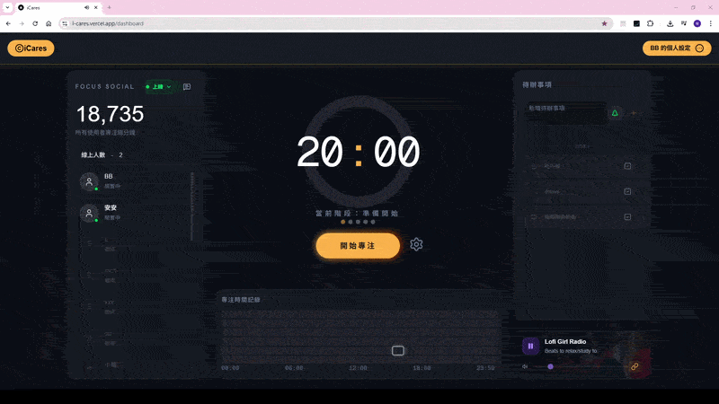

---

## 🏗 Architecture & Database Schema

### State Management & Modularity

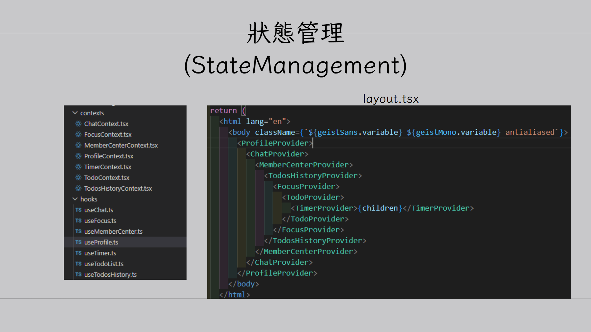

To maintain a clean and independent component structure, I implemented a centralized state management pattern:
* **Global Context Management:** At the top level of the application, I utilized multiple `Context Providers` (e.g., `TimerProvider`, `FocusProvider`, `TodoProvider`) to efficiently manage cross-component states.
* **Logic Extraction via Custom Hooks:** Complex logic processing and API requests are extracted into Custom Hooks (e.g., `useTimer`, `useProfile`). To prevent multiple UI components from repeatedly triggering API requests or causing unnecessary re-renders, these hooks are executed once within their corresponding Context, and the data is then dispatched downwards.

---

### System Architecture

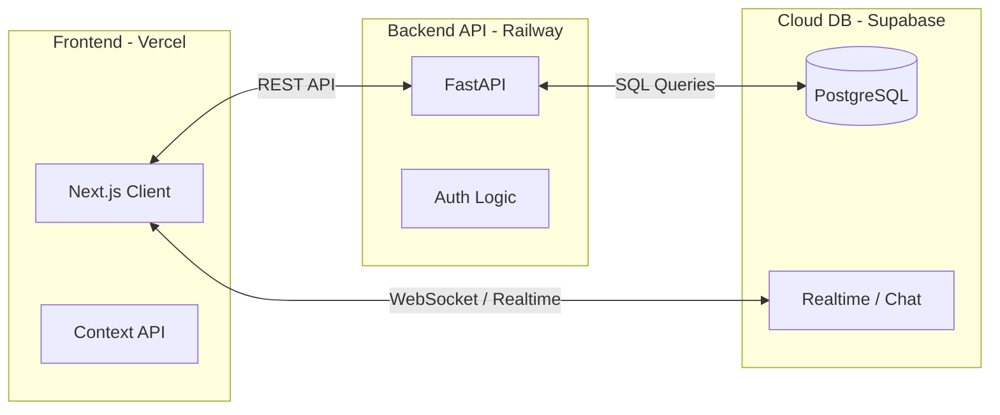

---

### Entity-Relationship (ER) Model

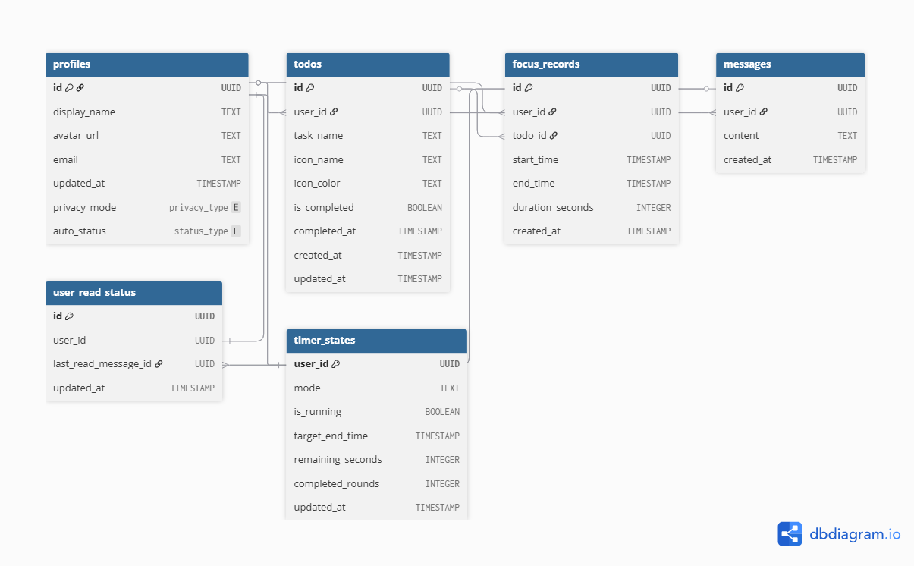

---

## Contact

* **Email:** [pon6543211@gmail.com](mailto:pon6543211@gmail.com)
* **CakeResume:** [Jun'sCakeResume](https://www.cake.me/pon6543211)
* **LinkedIn:** [Jun Peng Wang](https://www.linkedin.com/in/heartwar9420/)