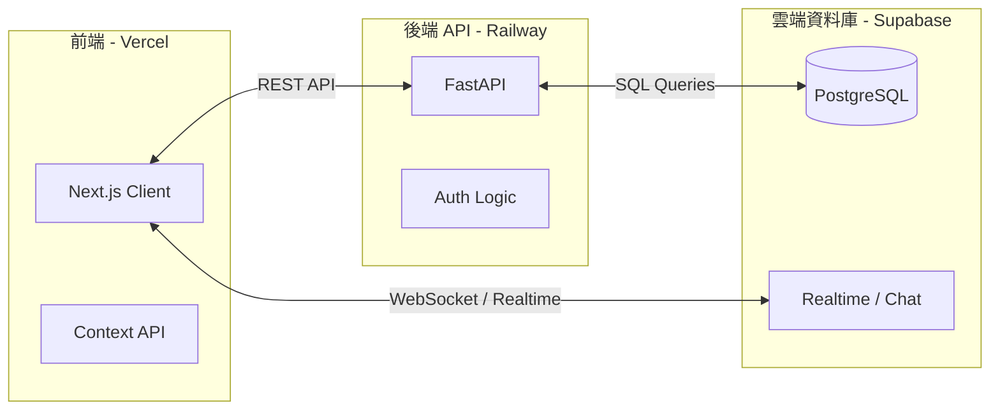

# iCares

一款結合番茄鐘、護眼提醒與待辦清單的生產力工具，協助使用者在保持高度專注的同時，也能兼顧眼睛健康。

🔗 **[Live Demo 網站連結](https://i-cares.vercel.app)**
*(歡迎點擊上方連結體驗，可使用以下測試帳號快速登入)*
* **測試帳號 (Test Account):** `aa@aa.com`
* **測試密碼 (Password):** `aaaaaa`

> 🇺🇸 [Read in English (閱讀英文版本)](./README.md)

---

##  關於專案 (About The Project)

開發 iCares 的契機源自我個人的經歷。2025 年 2 月，我因復發性角膜糜爛接受了眼部雷射手術。這段經歷讓我對眼睛疲勞變得極度敏感，也讓我深刻體會到保護視力的重要性。

我發現市面上的番茄鐘軟體大多只專注於提升工作效率，卻缺乏保護眼睛的機制。因此，我決定結合軟體開發技能與科學理論，親手打造一款能同時提升生產力與守護視覺健康的工具。

### 為什麼需要 iCares？ (傳統番茄鐘的痛點)
傳統的番茄鐘工作法（專注 25 分鐘 / 休息 5 分鐘）雖然降低了開始任務的門檻，但存在幾個明顯的缺陷：
1.  **時程僵化且可預測：** 固定的提醒時間容易讓大腦感到麻木，失去獎勵感與新鮮感。
2.  **主觀的時間設定：** 25 分鐘的區間是主觀設定的，並不完全符合人體天生的「次晝夜節律 (Ultradian Rhythms)」。
3.  **忽視眼睛健康：** 傳統番茄鐘只在乎工作產出，完全忽略了長時間深度專注對眼睛造成的壓力。

iCares 透過將四大科學理論融入核心的計時機制，解決了上述痛點。

### 科學基礎 (Scientific Foundations)

iCares 將科學理論轉化為實際的產品機制：

1.  **神經重放 (Neural Replay) & 變比率強化 (Variable Ratio Reinforcement)：** 類似於抽卡或滑短影音的隨機獎勵機制。系統會在專注期間隨機播放提示音，提醒使用者閉眼休息幾秒鐘。這種不確定性能刺激多巴胺分泌、維持專注力，並讓大腦有時間「重放」並鞏固剛剛吸收的記憶。
2.  **20-20-20 護眼法則：** 每 20 分鐘，系統會提示使用者看向 20 呎（約 6 公尺）外的遠方 20 秒，藉此放鬆眼部肌肉。
3.  **次晝夜節律 (Ultradian Rhythms)：** 當累積專注達 100 分鐘後，系統會觸發提醒，建議使用者進行 20 分鐘的低頻深度休息。

---

##  核心功能 (Key Features)

- **科學化護眼計時器：** 背景自動排程與播放提示音，完美整合變比率強化、20-20-20 法則與次晝夜節律。
- **專注社群 (Focus Social)：** 即時顯示線上使用者的狀態（專注中 / 離線）與累積專注總時數，並附帶聊天室功能，營造線上共學 / 共創的氛圍。
- **專注熱點圖 (Focus Heatmap)：** 將每日專注時間分佈視覺化，方便使用者追蹤長期學習或工作習慣。
- **整合式待辦清單：** 直覺的任務管理介面，與計時器無縫連動，協助使用者掌握進度。
- **情境音樂播放器：** 內建 Lofi Girl 電台，幫助使用者更快進入心流狀態。

---

##  實際操作展示 (Website DEMO)

### 1. 核心專注與待辦連動 (Main Features)
結合白噪音、番茄鐘倒數與待辦事項的沉浸式工作區。

### 2. 會員數據中心 (Member Center)
記錄每日專注時長。

### 3. 新手導覽教學 (Guide Page)
首次登入的互動式導覽，協助使用者快速理解科學護眼機制。

### 4. 響應式網頁設計 (RWD: Mobile & Tablet)
完整支援跨裝置體驗，無論在 360px 或 768px 皆能保持良好的操作動線。

  
  

---

##  技術棧 (Tech Stack)

**Frontend (前端)**

- **Framework:** Next.js, React
- **Language:** TypeScript
- **Styling & UI:** Tailwind CSS, Lucide Icons
- **State Management:** React Context API
- **Deployment:** Vercel

**Backend (後端)**

- **Framework:** FastAPI
- **Language:** Python
- **Deployment:** Railway

**Database & Tools (資料庫與工具)**

- **Database:** Supabase (PostgreSQL)
- **Version Control:** Git / GitHub

---

##  技術挑戰與解決方案 (Technical Challenges & Solutions)

**挑戰：瀏覽器休眠導致的計時器失準與狀態遺失**
當使用者將網頁縮小至背景或切換分頁時，瀏覽器為了節省效能會限制背景腳本的執行（Throttling），導致前端計時器變慢、與現實時間脫節。此外，重新整理或不小心關閉分頁，也會導致計時器的狀態完全消失。

**解決方案：伺服器權威模式 (Server Authority Pattern)**
為了解決這個問題，我放棄了脆弱的前端 `setInterval` 計時方式，改採「伺服器權威」架構：
1.  當專注會話開始時，前端會計算出預計的 `end_time`，並將其發送至後端 (FastAPI) 儲存於資料庫 (Supabase) 中。
2.  在每次前端重新渲染時，前端會透過讀取資料庫中的 `end_time` 減去當下的 `current_time`，來動態計算剩餘時間。
3.  **成果：** 無論瀏覽器在背景如何休眠限制、使用者如何切換分頁、重新整理或意外關閉，計時器都能保持絕對精準。當使用者重新開啟網頁時，專注狀態也能無縫恢復。

**實際解決效果展示：**
*(展示重整網頁或切換背景後，計時器依然精準對齊伺服器時間)*

---

##  系統架構與資料庫設計 (Architecture & Database Schema)

### 狀態管理與模組化 (State Management & Modularity)

為了保持元件結構的乾淨與獨立性，我實作了集中式的狀態管理模式：
* **全域 Context 管理：** 在應用程式的最頂層，使用多個 `Context Providers`（例如 `TimerProvider`、`FocusProvider`、`TodoProvider`）來有效管理跨元件的狀態。
* **邏輯抽離至 Custom Hooks：** 將複雜的邏輯處理與 API 請求抽離到自訂的 Hooks 中（例如 `useTimer`、`useProfile`）。為避免多個 UI 元件重複觸發 API 請求或導致不必要的重新渲染，這些 Hooks 會在對應的 Context 中統一執行一次，再將資料向下派發 (dispatch)。

---

### 系統架構圖 (System Architecture)

---

### 資料庫 ER 圖 (ER Diagram)

---

## Contact

* **Email:** [pon6543211@gmail.com](mailto:pon6543211@gmail.com)
* **CakeResume:** [王竣鵬的 CakeResume](https://www.cake.me/pon6543211)
* **LinkedIn:** [Jun Peng Wang](https://www.linkedin.com/in/heartwar9420/)